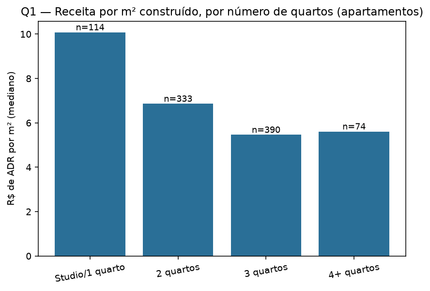
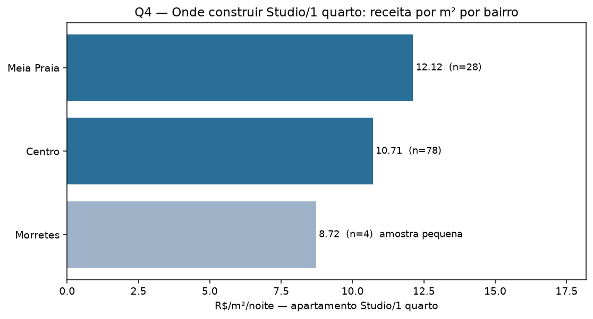
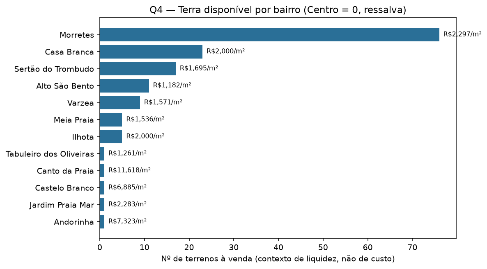
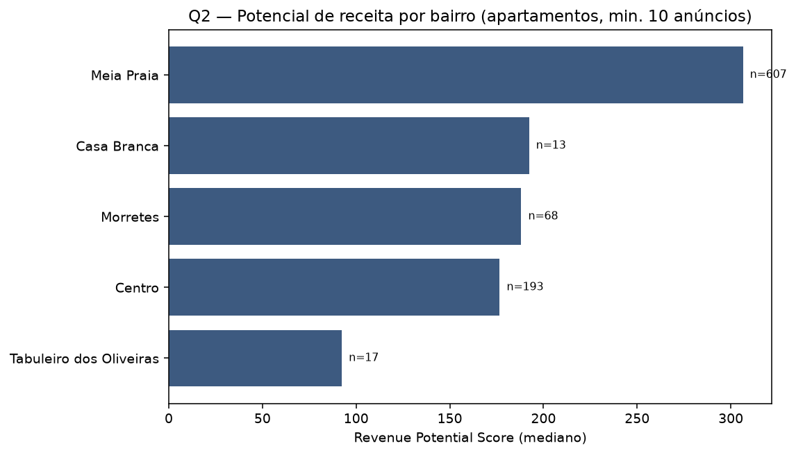
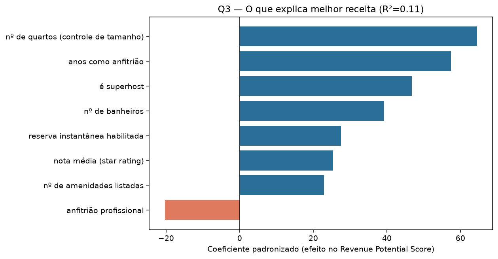

# Recomendação de Investimento — Mercado Imobiliário de Itapema/SC

*Hackathon Jovens Talentos AI Builder 2026 — Seazone. Análise de Guilherme Ximenes.*

Como rodar a análise que gerou este relatório: `python analysis/run_all.py` (ver `README.md`).

---

## O modelo de negócio da Seazone (pesquisado, não está nos dados)

A Seazone não é uma incorporadora tradicional. Ela estrutura uma **SPE (Sociedade de Propósito
Específico) por obra**: investidores entram como **sócios da construção**, o terreno fica em nome
da SPE, e cada obra é **autofinanciada só pelos próprios investidores** daquele projeto (ticket
médio ~R$ 250 mil, parcelado 48–54 meses) — sem margem de incorporadora tradicional embutida.
Depois de pronto, a Seazone opera as unidades como short stay via sua rede de microfranquias (8%
da receita de diária por franqueado). A empresa já vende esse exato produto (apartamento compacto
de short stay) sob a marca **"SPOT"**, com preços de ticket públicos no próprio marketplace — usado
como preço real de custo para estimar retorno (seção "Retorno estimado", abaixo), em vez do retorno
que a Seazone divulga para Itapema especificamente (dado da empresa, não produzido por esta
análise).

**A Seazone só constrói apartamentos**, e todas as perguntas abaixo são respondidas só sobre
`listing_type == "apartamento"`, nas duas bases (Airbnb e VivaReal). **Studio e 1 quarto foram
unidos numa categoria só** ("Studio/1 quarto"): studio sozinho tinha só 8 anúncios com preço em
toda a cidade — amostra pequena demais.

## Por que a métrica principal virou "receita por m²", não terreno nem cap rate

Um terreno sustenta várias unidades — não é "1 terreno = 1 apartamento". O custo de terra é
**diluído** entre as unidades do prédio, e o custo de obra por m² tende a ser parecido entre
bairros da mesma cidade (mesma mão de obra, mesmo material, CUB regional similar). Sem dado de
quantas unidades cabem em cada terreno (depende de zoneamento/gabarito — que aliás está mudando
agora em Itapema, ver seção de riscos), a métrica mais confiável que os dados sustentam é:

```
R$/m² = ADR mediano do Airbnb ÷ área útil mediana do apartamento pronto equivalente (VivaReal)
```

Isso aproxima "quanto retorna por real investido em construção", já que o custo é aproximadamente
proporcional ao tamanho. Terreno entra na análise só como **contexto de liquidez/execução**
(quantos lotes existem à venda), não como base de cálculo de retorno.

---

## Estrutura da resposta: duas camadas independentes

Tamanho do apartamento ("o que construir") e localização ("onde construir") respondem perguntas
diferentes e não precisam virar uma única combinação forçada — por isso a Pergunta 4 é respondida
em duas camadas separadas.

### Camada 1 — O que construir

| Tipologia | ADR mediano | Área mediana | R$/m²/noite |
|---|---:|---:|---:|
| **Studio/1 quarto** | R$ 433,5 | 43 m² | **R$ 10,08** |
| 2 quartos | R$ 480,0 | 70 m² | R$ 6,86 |
| 4+ quartos | R$ 1.065,0 | 190 m² | R$ 5,61 |
| 3 quartos | R$ 693,5 | 127 m² | R$ 5,46 |



**Studio/1 quarto rende quase o dobro por m² de qualquer outra tipologia.** Esse padrão se
confirma de forma robusta nos dois bairros com amostra suficiente para checar todas as tipologias
(Centro e Meia Praia, ver Camada 2) — não é um artefato de um bairro específico.

### Retorno estimado (ancorado em preço real de mercado, não em heurística de custo)

Usamos o preço real de um produto que a Seazone já vende — os **SPOTs**, apartamentos compactos de
short stay com preço de ticket público no marketplace da empresa — como custo para estimar retorno
sobre a nossa própria receita por m².

**Comparável mais próximo**: SPOT Ponta das Canas (Florianópolis/SC — mesmo estado de Itapema), 9
unidades de 1 quarto, **16,86 m² a 49,93 m²** (mesma faixa do nosso "Studio/1 quarto"), ticket de
**R$ 220.000 a R$ 423.000** → **R$ 8.472 a R$ 13.049 por m²**. A Seazone divulga **17,7% a.a.** de
retorno para esse SPOT específico (citado aqui só como referência — não usado no nosso cálculo).

**Nosso cálculo**: receita por m² do nosso próprio dado (R$ 10,08/m²/noite, Studio/1 quarto, Airbnb
+ VivaReal) × 365 × ocupação-base 50% ÷ preço real de ticket do comparável:

| Cenário (preço do ticket) | Cap rate estimado |
|---|---:|
| Unidade menor do comparável (R$ 13.049/m²) | 14,1% a.a. |
| Unidade maior do comparável (R$ 8.472/m², mais parecida com nossa área média) | 21,7% a.a. |

**Faixa: 14,1% a 21,7% a.a.** — cai dentro do que a própria Seazone declara para o produto SPOT em
geral (**13% a 23% a.a.**, em 5 outros SPOTs pesquisados) e muito perto do comparável mais próximo
geograficamente (17,7% a.a.). Não citamos o número da Seazone diretamente: nosso cálculo é
independente — feito com dados próprios de receita e um preço de mercado real e verificável — e
aterrissa na mesma faixa que o mercado já pratica para esse produto.

**Só apartamentos compactos têm esse comparável real**: a Seazone não vende SPOTs de 2 quartos ou
mais — o que é, por si só, mais uma evidência de que o mercado (não só os nossos dados) já validou
a tese do compacto como o produto certo para esse modelo de negócio.

### Camada 2 — Onde construir



| Bairro | R$/m² (Studio/1 quarto) | Amostra | Terrenos à venda |
|---|---:|---:|---:|
| Meia Praia | **R$ 12,12** | n=28 (confiável) | 5 |
| Centro | R$ 10,71 | n=78 (confiável) | 0 |
| Morretes | R$ 8,72 | n=4 (amostra pequena) | 76 |



**Meia Praia** tem o melhor R$/m² para compacto **e** o maior potencial de receita da cidade
(Q2), mas só 5 terrenos à venda hoje — pouco para uma estratégia em escala, e a Seazone competiria
por um estoque escasso (o que tende a inflar o preço desses lotes antes mesmo de tentar comprar).
**Centro** vem em segundo lugar bem próximo (R$ 10,71/m², amostra robusta com 78 anúncios) e tem
potencial de receita razoável (4º lugar em Q2) — mas **não há terreno listado à venda hoje**
(ressalva de execução, não motivo de exclusão: vale prospecção direta/off-market, já que a ausência
de anúncios não prova ausência de terra, só de oferta publicada). **Morretes** tem de longe a maior
liquidez de terreno (76 lotes) mas a amostra de Studio/1 quarto lá é pequena demais (n=4) para
confiar no R$/m² — não há evidência de que compacto funcione tão bem ali, nem de que não funcione.
**Ilhota** tem só 5 anúncios de apartamento com preço no Airbnb e 5 terrenos à venda — abaixo do
corte mínimo de confiabilidade (10): dado insuficiente para dizer qualquer coisa com confiança
sobre esse bairro, não uma rejeição.

**Não existe uma resposta única de bairro** — depende da prioridade:
- **Retorno máximo por m²:** Meia Praia, com ressalva de escassez de terreno.
- **Retorno quase igual, sem essa escassez confirmada:** Centro, com ressalva de terreno não
  listado hoje.
- **Execução em escala garantida agora:** Morretes, mas sem confirmação de que compacto funciona
  tão bem lá, e com risco regulatório documentado (ver abaixo).

---

## Veredito sobre a tese interna

> *"A análise interna sugere apartamentos compactos (studio/1 quarto) na região do Centro."*

**A parte "compacto" está fortemente confirmada; a parte "Centro" é competitiva, não descartável.**

- **A parte "compacto" está fortemente confirmada**: Studio/1 quarto rende quase o dobro de
  receita por m² que qualquer outra tipologia, de forma consistente nos dois bairros com dados
  suficientes para checar (Centro e Meia Praia).
- **A parte "Centro" é competitiva, não descartável**: R$ 10,71/m² é o 2º melhor da cidade, muito
  perto do líder (Meia Praia, R$ 12,12/m²), com amostra robusta (78 anúncios). A ausência de
  terreno listado hoje é uma ressalva real de execução — mas não um motivo para rejeitar o Centro
  como boa aposta de retorno.
- **O que a tese não previa, e os dados mostram**: Meia Praia empata ou levemente supera o Centro
  tanto em receita por m² de compacto quanto em potencial de receita geral (Q2) — vale considerar
  como alternativa de prioridade equivalente, com o mesmo tipo de ressalva de execução (lá por
  escassez de terreno, não por ausência dele).

Compacto é a melhor aposta de tipologia (confirmado com força), e de localização, Centro e Meia
Praia são as duas melhores opções — ambas com uma barreira de execução específica (terreno) que
precisa ser resolvida fora dos dados fornecidos (prospecção direta, negociação privada, ou
monitorar novos anúncios).

---

## Riscos e contexto regulatório (pesquisa externa — qualitativo, não ajusta os números acima)

- **Meia Praia**: sujeita à regra do **"cone de sombra"**, que limita altura de prédios na orla
  (mais restritiva que Balneário Camboriú). Mas a **Lei Complementar 113/2021** criou a "Operação
  Urbana Consorciada Meia Praia": construtoras podem pagar outorga onerosa para construir mais
  alto, financiando ~R$ 180 milhões em infraestrutura (alargamento de praia). Ainda depende de
  licenciamento ambiental final — mas é uma via legal já criada que pode liberar mais unidades por
  terreno em Meia Praia no médio prazo, reforçando ainda mais essa opção.
- **Morretes**: parte do território é área de encosta — declive acima de 45° é **APP (Área de
  Preservação Permanente)**, não edificável por lei federal. Há monitoramento ativo de risco
  geológico na região (Morro Feijó) e histórico de ocupação irregular em área de preservação. O
  bairro está num **programa municipal de regularização fundiária (REURB)**, para imóveis
  "adquiridos de boa-fé em loteamentos abandonados" — ou seja, parte do parcelamento do solo teve
  origem informal, só agora sendo formalizada. **Isso significa que nem todos os 76 terrenos
  listados são necessariamente prontos para construir sem checagem individual de declividade e
  situação registral.**
- **Casa Branca, Tabuleiro dos Oliveiras e Ilhota** também estão no mesmo programa de REURB —
  mesma ressalva de origem de loteamento se aplica.
- **Centro**: nenhuma restrição especial encontrada (sem tombamento histórico), mas segue sem
  terreno listado à venda hoje.
- Itapema está com **Plano Diretor e Código de Obras em revisão recente** (leis complementares
  143/2024 e 147/2025) — o ambiente regulatório está mudando agora, o que adiciona incerteza a
  qualquer suposição de gabarito/densidade.

---

## Metodologia e limitações (leia antes dos números)

Os dados **não contêm histórico real de reservas/ocupação**. `Price_AV_Itapema.csv` cobre **22,5%
dos 4.441 anúncios** (999; 911 são apartamentos) — é uma amostra de cotações de diária (ADR) para
datas futuras, capturada em só 3 rodadas de scrape (jan/2025), não um histórico de reservas.

- **R$/m² é a métrica principal** para comparar tipologias e bairros (ver seção dedicada acima); o
  retorno em % a.a. usa, além disso, preço real de mercado (seção "Retorno estimado").
- **Checagem de viés**: comparei a distribuição do subconjunto com preço contra a população total.
  Centro está levemente sobrerrepresentado no subconjunto com preço (20,5% vs. 14,8% da
  população); apartamentos estão sobrerrepresentados (91,2% vs. 83,5%) — reforço a mais para
  restringir a análise a apartamentos.
- **Amostra mínima de confiança**: 10 anúncios de apartamento com preço por combinação
  bairro×tipologia. Combinações abaixo disso são reportadas como referência, nunca como conclusão
  (caso de Morretes para Studio/1 quarto, Ilhota em geral).
- **VivaReal é uma foto única** (todas as 8.327 linhas com a mesma `aquisition_date`, 2025-01-11) —
  sem série histórica de preço, então não medimos valorização passada, só um retrato do mercado
  hoje.
- **Retorno estimado (seção da Camada 1)** usa preço real de ticket por m² de um SPOT Seazone
  comparável (Ponta das Canas/SC), não uma heurística de custo — mas ainda assume ocupação de 50%
  (não observada) e é receita bruta: não deduz o repasse de 8% ao franqueado, taxas de plataforma,
  impostos, nem custos de gestão. Deve ser lido como retorno bruto, não como líquido esperado.

---

## Pergunta 2 — Melhor localização por receita (apartamentos)



**Meia Praia** lidera com folga (score 306, n=607), puxado por demanda mais alta (19 reviews
medianos) e ADR competitivo (R$ 600). Casa Branca e Morretes aparecem em seguida com scores bem
mais baixos (192 e 188, amostras menores). **Centro fica em 4º lugar** (score 177, n=193). Ilhota,
Canto da Praia e Alto São Bento ficaram de fora por amostra insuficiente.

## Pergunta 3 — Que características explicam melhores receitas? (apartamentos)



Regressão linear múltipla (features padronizadas) sobre o Revenue Potential Score, controlando
pelo número de quartos (R² = 0,114 — modesto, esperado dado que o score já é um proxy ruidoso).
Após controlar o tamanho, os fatores com maior efeito positivo são, em ordem: **anos de experiência
do anfitrião**, **ser superhost**, número de banheiros, reserva instantânea habilitada, nota média
(star rating) e número de amenidades. **Anfitrião "profissional"** (gestoras/empresas) tem efeito
negativo — operação pessoal e experiente supera operação em escala nesta base. (Nota:
`guest_satisfaction_overall` foi excluída do modelo por colinearidade com `star_rating`, r=0,85.)

---

## Próximos passos

1. **Prospecção direta de terreno em Centro e Meia Praia** (fora do estoque hoje listado no
   VivaReal) — os dois bairros com melhor R$/m² para compacto são justamente os com menos oferta
   pública de terra.
2. Checar individualmente a situação de declividade/APP e regularização fundiária de qualquer
   terreno em Morretes (ou Casa Branca/Tabuleiro/Ilhota) antes de negociar — o estoque de 76 lotes
   não é homogêneo em termos de risco.
3. Buscar dado de ocupação real (calendário completo do Airbnb) para substituir o proxy de ADR ×
   percentil de reviews por uma estimativa de receita mais direta.
4. Acompanhar o desfecho do licenciamento ambiental da Operação Urbana Consorciada Meia Praia —
   se aprovado, pode liberar mais densidade construtiva ali, reforçando a aposta nesse bairro.
5. Coletar amostra de Airbnb Studio/1 quarto em Morretes (hoje só 4 anúncios) antes de descartar ou
   confirmar esse bairro para a tipologia compacta.
